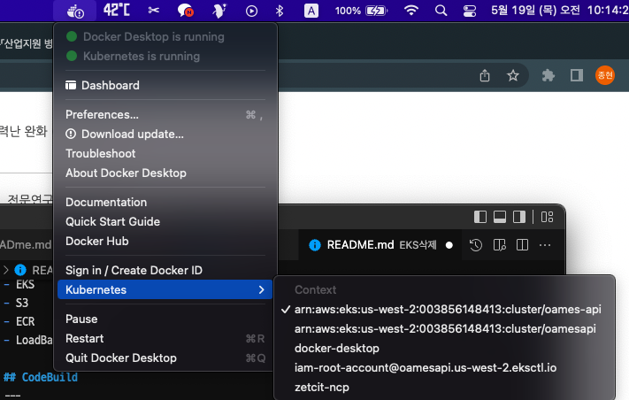
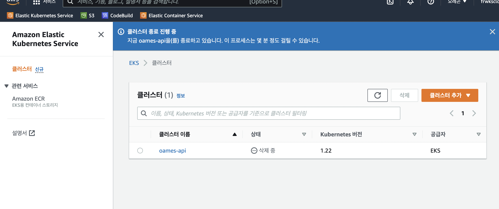

# EKS삭제

삭제 목록
- CodeBuild
- S3
- EKS
- ECR
- LoadBalancer
- 타겟 그룹
- VPC NAT 게이트웨이
- 네트워크 인터페이스
- VPC
- 서브넷
- 탄력적 IP 주소

## CodeBuild
---
AWS CodeBuild에 들어가서 빌드 프로젝트 삭제를 누르면 됨\
코드빌드는 파이프라인이 걸려있지 않는 이상 삭제 시 걸리는 부분이 없음

## S3
---
AWS S3에 들어가서 버킷 삭제를 누르면 됨\

## EKS
--- 
Docker Desktop에 Kubernetes를 AWS에서 사용하는 쿠버네티스로 변경 후
터미널에서 ``` EKSctl delete cluster --name <클러스터명> ```을 입력하여 노드를 삭제 함



AWS EKS 웹페이지를 들어가서 노드가 삭제된 클러스터를 삭제함



## ECR
---
AWS ECR 들어가서 리포지토리 삭제하면 됨

## LoadBalancer
---
EKS 지우면서 같이 삭제됐는데 만약 로드밸런서를 만들고 클러스터에 연결한거라면 따로 삭제해줘야 할 것같음

## 타겟 그룹
---
AWS EC2 타겟 그룹에 EKS와 관련된 내용을 모두 삭제함

## VPC NAT 게이트웨이
---
AWS VPC NAT 게이트웨이에 EKS에서 사용했던 게이트웨이를 삭제함

## 네트워크 인터페이스
---
AWS EC2 네트워크 인터페이스에서 VPC에 연관된 인터페이스를 삭제함
> VPC에 연관된 NAT 게이트웨이를 먼저 지우고 작업해야함 \
> 삭제 시 오류는 뜨지만 새로고침하면 삭제 되어있음

## VPC
---
AWS VPC에 EKS와 관련된 VPC를 삭제함
> NAT 게이트웨이와 네트워크 인터페이스가 연동되어 위 작업을 먼저 하고 삭제함

## 서브넷
---
AWS VPC 서브넷에 EKS와 관련된 서브넷 삭제함

## 탄력적 IP 주소
---
AWS EC2 탄력적 IP(Public IP) 페이지에서 작업->탄력적 IP 주소 

~~릴리스 누르면 삭제된다는데 탄력적 IP 주소 릴리즈가 활성화가 안되어 있음...~~

VPC를 지우고 다시 가보니 릴리스로 삭제할 수 있었음
