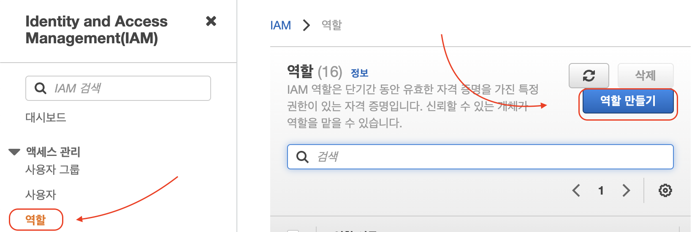
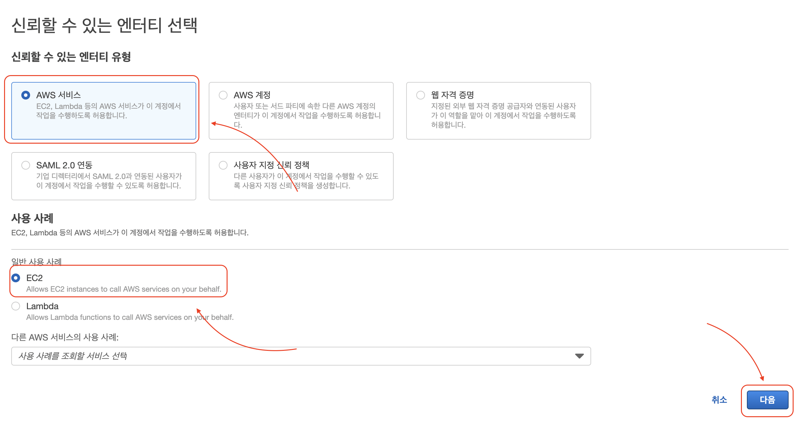
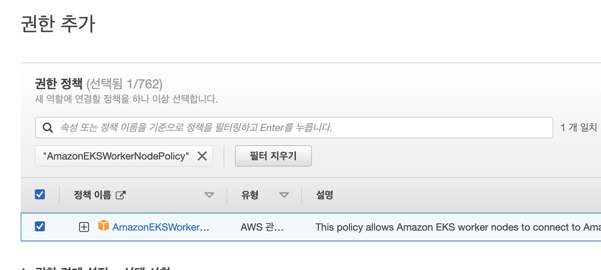
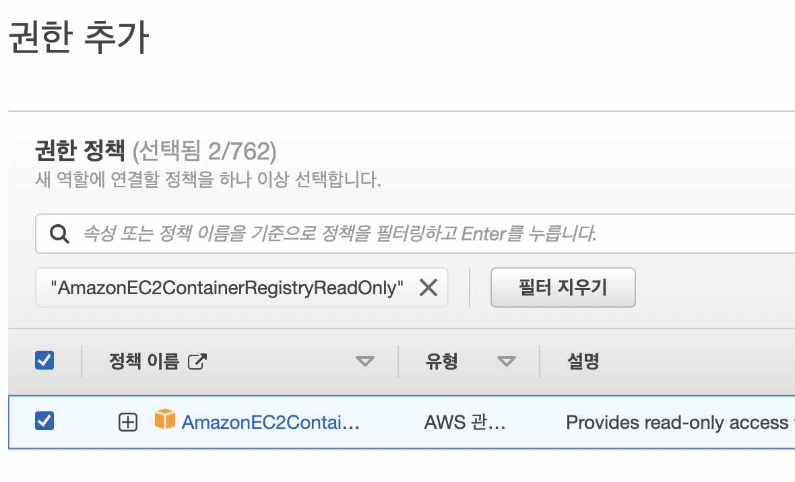
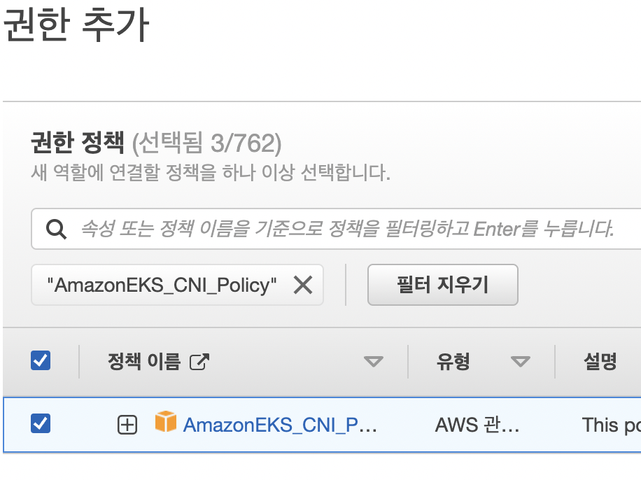
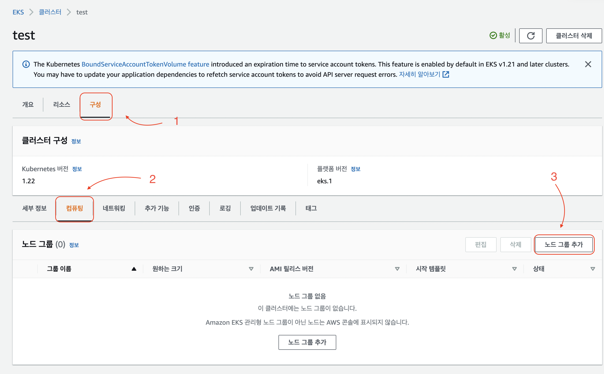
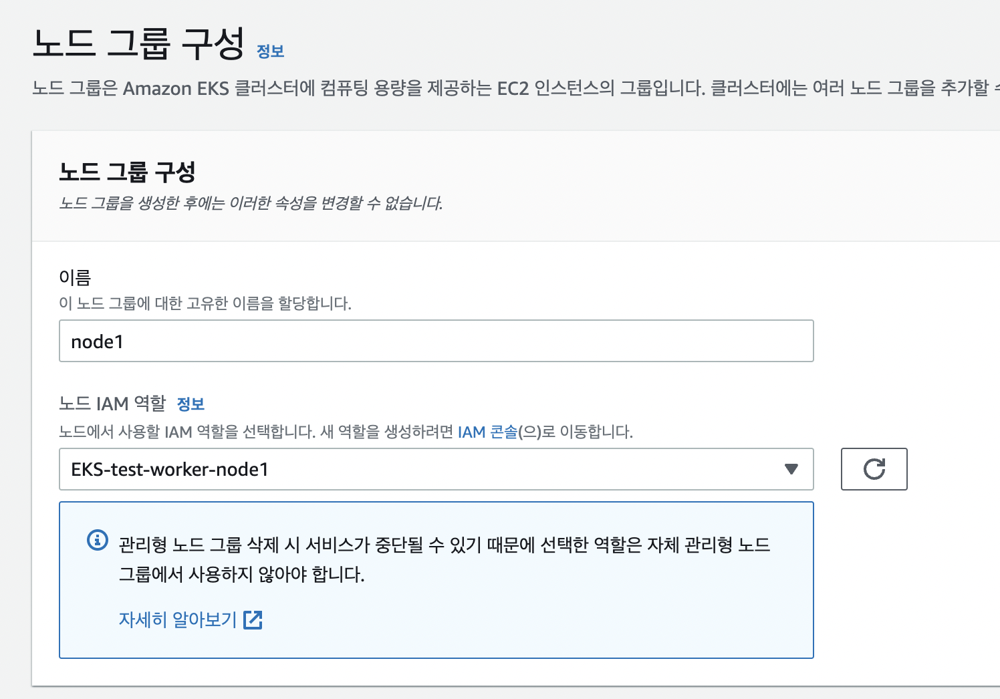
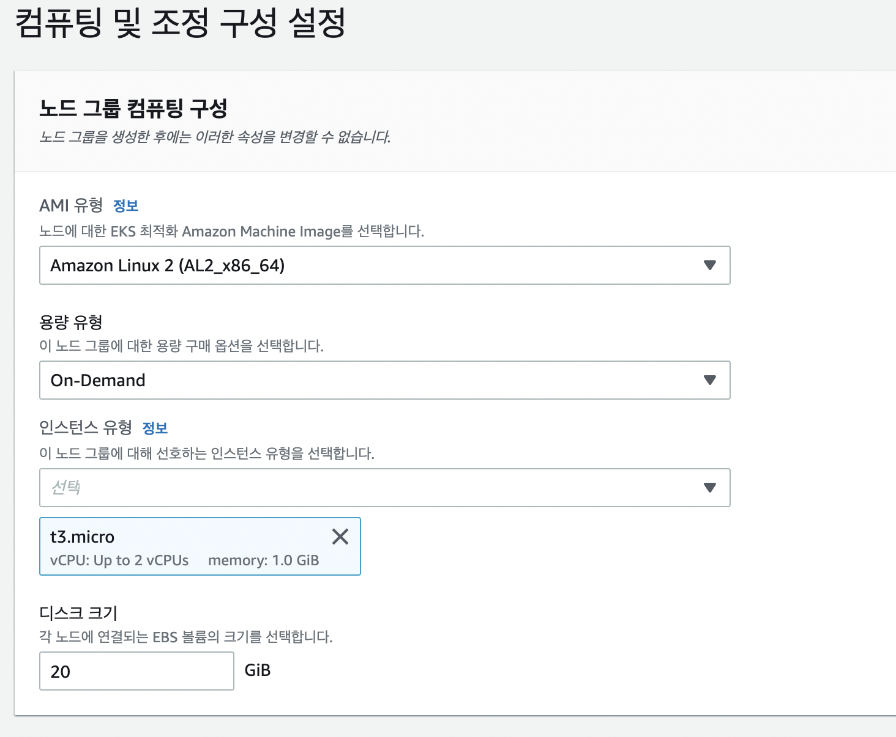
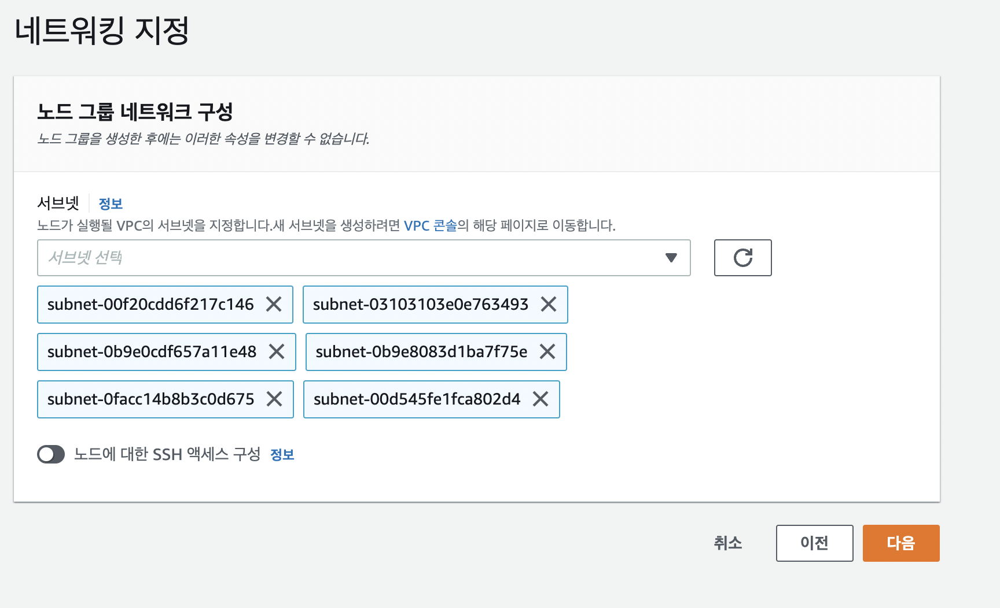

# EKS Node 생성 가이드
1. IAM 역할 생성
    
2. AWS EC2사례 선택
   
3. ```AmazonEKSWorkerNodePolicy``` 검색 후 선택
    
4. 필터 지우기 클릭, ```AmazonEC2ContainerRegistryReadOnly``` 검색 후 선택
    
5. 필터 지우기 클릭, ```AmazonEKS_CNI_Policy``` 검색 후 선택
    
6. 역할 이름 설정 후 역할생성하기
7. EKS 가서 클러스터 컴퓨팅 노드 그룹 추가 클릭
    
8. 위에서 생성한 IAM역할 선택
    
9. 인스턴스 유형(컴퓨팅 성능) 원하는 성능으로 설정
    
10. 다음
    
11. 다음을 눌러 생성
    