# Ubuntu 20.04.4 amd/arm

※ amd와 arm를 잘 구분할 것

> 명령어 중에 들어가는 괄호는 실제로 적을 때는 사용하지 않음.\
> <> : 계정정보, 토큰, 바뀌어도 되는 이름 등.\
> [] : 필수로 들어가는 내용이 아닌경우.

## 설치 내역
- [Ubuntu 20.04.4 amd/arm](#ubuntu-20044-amdarm)
  - [설치 내역](#설치-내역)
  - [apt 업데이트](#apt-업데이트)
  - [Docker 설치](#docker-설치)
  - [Helm 설치](#helm-설치)
  - [kubectl 설치](#kubectl-설치)
  - [eksctl 설치](#eksctl-설치)
  - [aws cli 설치](#aws-cli-설치)
  - [aws 인증 설정](#aws-인증-설정)
  - [eks cluster 생성](#eks-cluster-생성)
  - [EKS Node 생성](#eks-node-생성)
  - [ArgoCD cli 설치](#argocd-cli-설치)
  - [ArgoCD 설치 및 접속](#argocd-설치-및-접속)
  - [GitHub에 SSH 등록](#github에-ssh-등록)
  - [ArgoCD 레포지토리 등록](#argocd-레포지토리-등록)
  - [ArgoCD 앱 생성](#argocd-앱-생성)
  - [AWS Load Balancer Controller 설치](#aws-load-balancer-controller-설치)
  - [AWS ECR 생성](#aws-ecr-생성)
  - [테스트서버 파일 생성](#테스트서버-파일-생성)
  - [GitHub 개인용 엑세스 토큰 생성](#github-개인용-엑세스-토큰-생성)
  - [AWS CodeBuild 역할 생성](#aws-codebuild-역할-생성)
  - [AWS CodeBuild 세팅](#aws-codebuild-세팅)
  - [LoadBalancer](#loadbalancer)

## apt 업데이트
```
sudo apt-get update
```

## Docker 설치
1. 이전 Docker삭제
    ```
    sudo apt-get remove docker docker-engine docker.io containerd runc
    ```
2. Docker를 설치하는데 필요한 프로그램 설치
    ```
    sudo apt-get install \
        ca-certificates \
        curl \
        gnupg \
        lsb-release
    ```
3. Docker의 공식 GPG 키 추가
    ```
    curl -fsSL https://download.docker.com/linux/ubuntu/gpg | sudo gpg --dearmor -o /usr/share/keyrings/docker-archive-keyring.gpg
    ```
4. 저장소 설치
    ```
    echo \
    "deb [arch=$(dpkg --print-architecture) signed-by=/usr/share/keyrings/docker-archive-keyring.gpg] https://download.docker.com/linux/ubuntu \
    $(lsb_release -cs) stable" | sudo tee /etc/apt/sources.list.d/docker.list > /dev/null
    ```
    > 이 명령어의 []괄호는 다 적어야 합니다.
5. 도커 엔질 설치
    ```
    sudo apt-get update
    sudo apt-get install docker-ce docker-ce-cli containerd.io docker-compose-plugin
    ```

## Helm 설치
```
curl https://raw.githubusercontent.com/helm/helm/master/scripts/get-helm-3 > get_helm.sh

chmod 700 get_helm.sh

./get_helm.sh
```

## kubectl 설치
1. 디렉토리 위치 변경
    ```
    cd ~
    ```
2. AWS S3에 있는 쿠버네티스 바이너리 설치
    - amd
        ```
        curl -o kubectl https://amazon-eks.s3.us-west-2.amazonaws.com/1.21.2/2021-07-05/bin/linux/amd64/kubectl
        ```
    - arm
        ```
        curl -o kubectl https://amazon-eks.s3.us-west-2.amazonaws.com/1.21.2/2021-07-05/bin/linux/arm64/kubectl
        ```
3. 쿠버네티스 SHA-256합계 설치
    - amd
        ```
        curl -o kubectl.sha256 https://amazon-eks.s3.us-west-2.amazonaws.com/1.21.2/2021-07-05/bin/linux/amd64/kubectl.sha256
        ```
    - arm
        ```
        curl -o kubectl.sha256 https://amazon-eks.s3.us-west-2.amazonaws.com/1.21.2/2021-07-05/bin/linux/arm64/kubectl.sha256
        ```
4. 합계 확인
    ```
    openssl sha1 -sha256 kubectl
    ```
5. 바이너리에 실행 권한 추가
    ```
    chmod +x ./kubectl
    ```
6. 바이너리를 PATH에 추가
    ```
    mkdir -p $HOME/bin && cp ./kubectl $HOME/bin/kubectl && export PATH=$PATH:$HOME/bin

    echo 'export PATH=$PATH:$HOME/bin' >> ~/.bashrc

    source ~/.bashrc
    ```
7. 버전 확인
    ```
    kubectl version --short --client
    ```

## eksctl 설치
- amd
    ```
    curl --silent --location "https://github.com/weaveworks/eksctl/releases/latest/download/eksctl_$(uname -s)_amd64.tar.gz" | tar xz -C /tmp

    sudo mv /tmp/eksctl /usr/local/bin
    ```
- arm
    ```
    curl --silent --location "https://github.com/weaveworks/eksctl/releases/latest/download/eksctl_$(uname -s)_arm64.tar.gz" | tar xz -C /tmp

    sudo mv /tmp/eksctl /usr/local/bin
    ```

## aws cli 설치
- amd
    ```
    curl "https://awscli.amazonaws.com/awscli-exe-linux-x86_64.zip" -o "awscliv2.zip"

    unzip awscliv2.zip

    sudo ./aws/install

    aws --version
    ```
- arm
    ```
    curl "https://awscli.amazonaws.com/awscli-exe-linux-aarch64.zip" -o "awscliv2.zip"

    unzip awscliv2.zip
    
    sudo ./aws/install

    aws --version
    ```

## aws 인증 설정
```
aws configure [--profile <생성할 프로필명>]

AWS Access Key ID [None] : <발급받은 IAM의 Access Key ID>
AWS Secret Access Key [None] : <발급받은 IAM의 Secret Access Key>
Default region name [None] : <기존으로 사용할 리전 | ex) ap-northeast-2>
Default output format [None] : <json, xml 등... 비워놔도 됨>
```
>--profile 을 사용하지 않으면 전역설정이 되며\
>--profile 옵션으로 사용 시 aws, eksctl 명령어 뒤에 --profile <프로필명>으로 계정 접근

## eks cluster 생성
- fargate를 사용해서 CloudeFormation을 생성
    ```
    eksctl create cluster --name <생성할 클러스터 명> --region <리전코드> --fargate [--profile <프로필명>]
    ```
    > --profile을 까먹었다면 [aws 인증 설정](#aws-인증-설정)을 참고

- 이미 생성했지만 연결해야 되는 경우
  1. 계정 연동이 잘 되었는지 확인
        ```
        aws sts get-caller-identity
        ```
  2. 클러스터 연결
        ```
        aws eks --region <리전> update-kubeconfig --name <클러스터 명>
        ```
  3. 클러스터 연결 확인
        ```
        kubectl get svc
        ```

## EKS Node 생성
[EKS Node 생성 가이드](./EKS_Node.md#eks-node-생성-가이드)

## ArgoCD cli 설치
- amd
    ```
    sudo curl -L -o /usr/local/bin/argocd https://github.com/argoproj/argo-cd/releases/latest/download/argocd-linux-amd64

    sudo chmod +x /usr/local/bin/argocd

    argocd version
    ```
- arm
    ```
    sudo curl -L -o /usr/local/bin/argocd https://github.com/argoproj/argo-cd/releases/latest/download/argocd-linux-arm64

    sudo chmod +x /usr/local/bin/argocd

    argocd version
    ```

## ArgoCD 설치 및 접속
1. 원하는 클러스터에 접속되어 있는지 확인
    ```
    kubectl config current-context
    ```
2. 네임스페이스 생성 및 등록
    ```
    kubectl create namespace argocd
    kubectl apply -n argocd -f https://raw.githubusercontent.com/argoproj/argo-cd/stable/manifests/install.yaml
    ```
3. ArgoCD 포트포워딩
    ```
    kubectl port-forward svc/argocd-server -n argocd 8080:443
    ```
    > 실행 후 터미널을 사용할 수 없으므로 다른 터미널을 추가로 열어서 진행할 것
4. ArgoCD 패스워드 확인
    ```
    kubectl -n argocd get secret argocd-initial-admin-secret -o jsonpath="{.data.password}" | base64 -d
    ```
5. 웹주소 창에 ``` localhost:8080 ``` 입력하여 접속
6. 아이디는 admin으로 고정이며, 비밀번호는 4번에서 확인한 내용으로 기입

## GitHub에 SSH 등록
[ssh 생성 및 등록](https://github.com/AuMaHub/how-to-use-git/tree/master/git%20ssh%20%EC%83%9D%EC%84%B1)

## ArgoCD 레포지토리 등록
1. ArgoCD cli로 로그인
    ```
    argocd login localhost:8080
    ```
> ArgoCD 포트포워딩이 되어있는 상태여야함
2. ArgoCD 계정 입력
    ```
    WARNING: server certificate had error: x509: certificate signed by unknown authority. Proceed insecurely (y/n)? y    
    Username: admin
    Password: 
    'admin:login' logged in successfully
    Context 'localhost:8080' updated

    ```
3. ArgoCD repo연결
    ```
    argocd repo add git@github.com:<Git아이디>/<레포지토리>.git --ssh-private-key-path ~/.ssh/<ssh-key명> --upsert
    ```

## ArgoCD 앱 생성

1. ArgoCD WEB(위에서 포트포워딩 한거)에서 Applications의 NEW APP을 클릭
    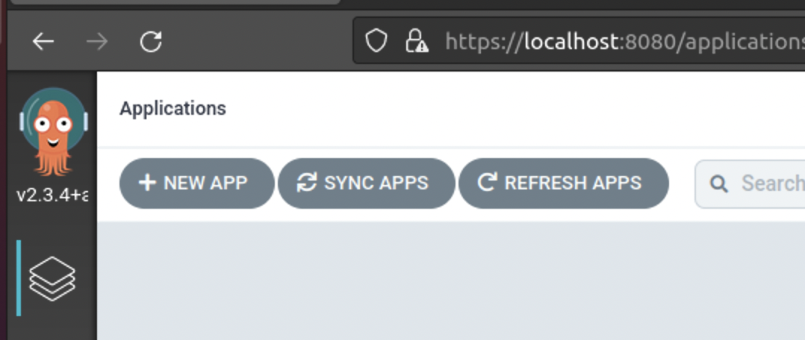
2. 앱 이름을 적어주고 Project를 디폴트로 선택
    
3. 아까 등록한 레포지토리를 선택. 브렌치를 입력하거나 냅둡. deploy파일이 있는 폴더를 지정(최상위 폴더에 있다면 ./ 로 입력)
    
4. 클러스터(...default.svc는 argocd 포트포워딩 할 때 접속된 클러스터)를 선택. 네임스페이스는 default라고 입력
    

## AWS Load Balancer Controller 설치

1. IAM 정책 다운로드
    ```
    curl -o iam_policy.json https://raw.githubusercontent.com/kubernetes-sigs/aws-load-balancer-controller/v2.4.0/docs/install/iam_policy.json
    ```
2. IAM 정책 생성
    ```
    aws iam create-policy \
    --policy-name AWSLoadBalancerControllerIAMPolicy \
    --policy-document file://iam_policy.json
    ```
3. kube-system 네임스페이스에 aws-load-balancer-controller 서비스 추가
    ```
    eksctl create iamserviceaccount \
        --cluster=<클러스터명> \
        --namespace=kube-system \
        --name=aws-load-balancer-controller \
        --attach-policy-arn=arn:aws:iam::<AWS-account>:policy/AWSLoadBalancerControllerIAMPolicy \
        --override-existing-serviceaccounts \
        --approve
    ```
    > AWS-account 확인 명령어 : ``` aws sts get-caller-identity --query Account --output text ``` \
    >
    > ``` Error: unable to create iamserviceaccount(s) without IAM OIDC provider enabled ``` 라는 에러가 뜨면 아래 명령어로 IAM OIDC 공급자 생성 후 다시 시도
   > ```
   > eksctl utils associate-iam-oidc-provider --cluster <클러스터명> --approve
   > ```

4. eks-charts 리포지토리 추가
    ```
    helm repo add eks https://aws.github.io/eks-charts
    ```
5. helm 업데이트
    ```
    helm repo update
    ```
6. AWS Load Balancer Controller 설치
    ```
    helm install aws-load-balancer-controller eks/aws-load-balancer-controller \
        -n kube-system \
        --set clusterName=<클러스터명> \
        --set serviceAccount.create=false \
        --set serviceAccount.name=aws-load-balancer-controller \
        --set image.repository=<공식문서 리전별 레지스트리 주소>/amazon/aws-load-balancer-controller \
        --set region=<리전 코드> \
        --set vpcId=<vpc-xxxxxxxx>
    ```
> image.repository는 [aws공식문서](https://docs.aws.amazon.com/ko_kr/eks/latest/userguide/add-ons-images.html)를 참조하고, 서울인 경우 ``` 602401143452.dkr.ecr.ap-northeast-2.amazonaws.com/ ```를 입력\
> 
> vpcId는 aws eks 클러스터 > 구성 > 네트워킹에서 확인 할 수 있음\
> 

7. 적용
    ```
    kubectl apply -k "github.com/aws/eks-charts/stable/aws-load-balancer-controller/crds?ref=master"
    ```
8. 확인
    ```
    kubectl get deployment -n kube-system aws-load-balancer-controller
    ```

## AWS ECR 생성
1. 프라이빗 선택과 이름만 적고 바로 생성
    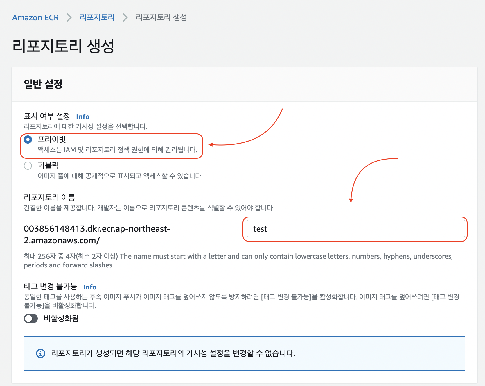
2. 접근 URI 메모해두기
    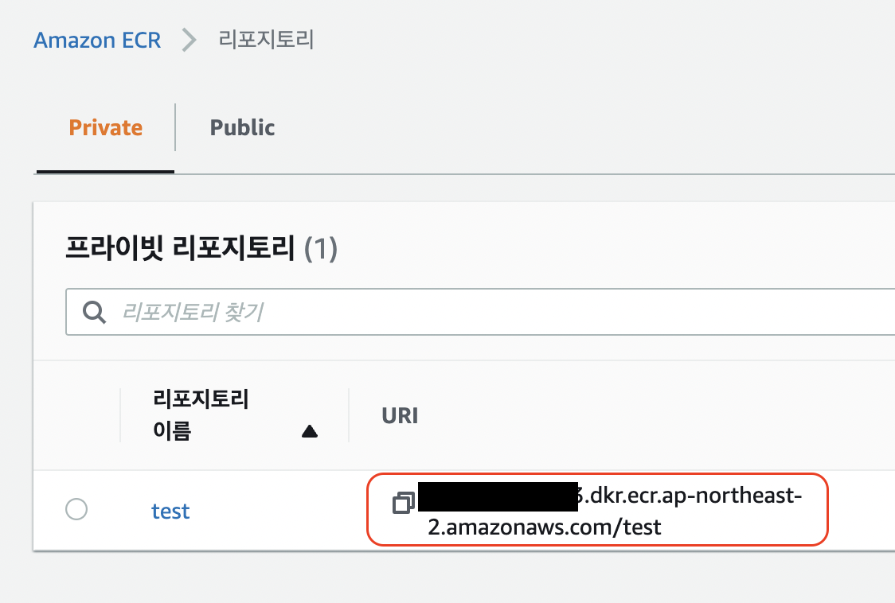

## 테스트서버 파일 생성
[테스트서버 작성](부가설명/testServerCode.md#테스트서버-작성)

## GitHub 개인용 엑세스 토큰 생성
1. 계정의 설정으로 이동\
    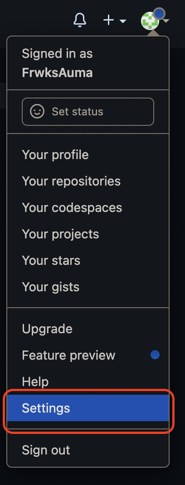
    
2. 메뉴 최하단 개발자 세팅 클릭\
    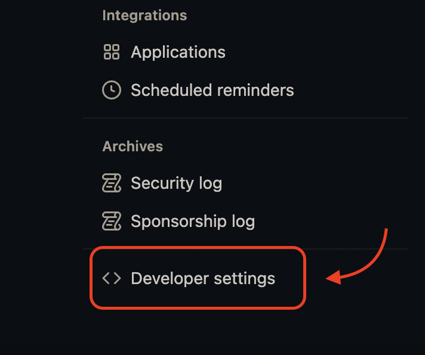

3. 개인 엑세스 토큰 생성 클릭\
    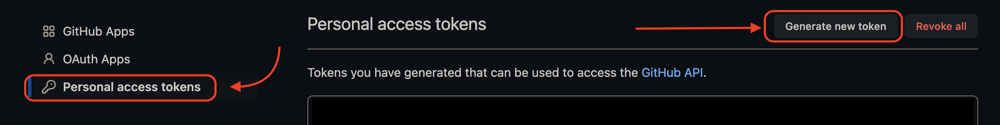

4. 이름, 유효기간 설정 후 레포지토리 접속권한과 hook권한만 체크하고 생성\
    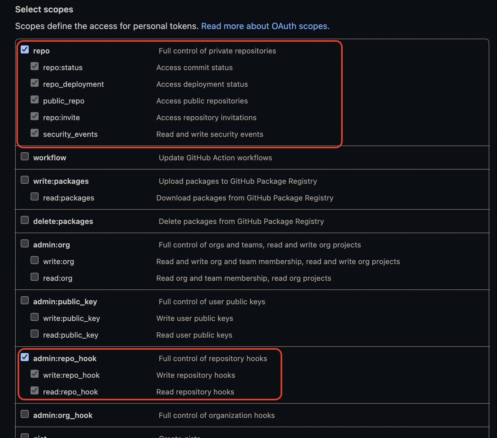

5. 생성되면 토큰을 주는데 다른 페이지로 이동 시 다시는 못보니 꼭 복사 해둘것\
    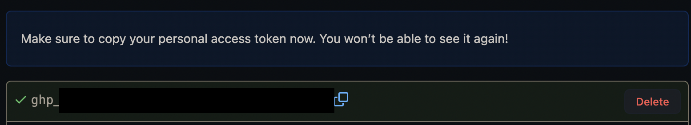

## AWS CodeBuild 역할 생성
[코드빌드 역할 생성](부가설명/CodeBuild_role.md#codebuild-role)

## AWS CodeBuild 세팅
1. 프로젝트 이름과 설명을 입력
2. 소스 공급자를 Github로 변경 후 [액세스 토큰](#github-개인용-엑세스-토큰-생성)을 입력하고 토큰을 저장함\
    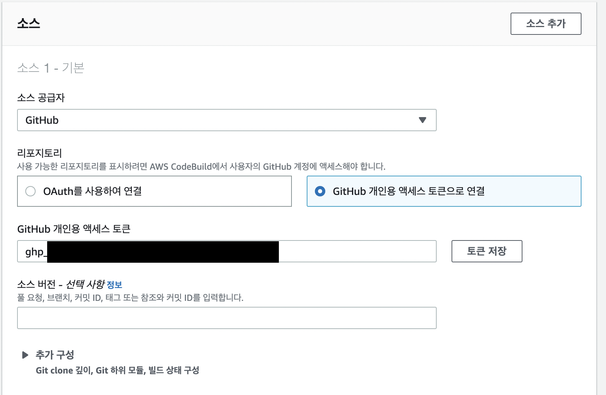
3. 코드빌드할 레포지토리를 선택함
4. Webhook 이벤트 유형은 PUSH만 선택하고 HEAD_REF에 ``` ^refs/heads/<브렌치명>$ ``` 을 입력\
    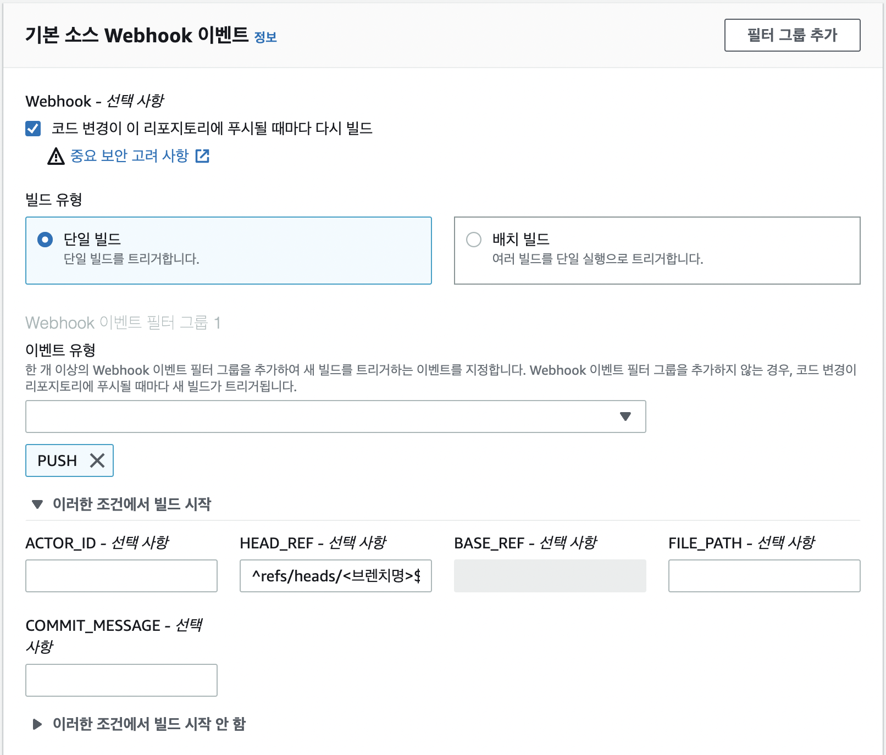
    > 빌드만 하는 브렌치가 있는 편이 관리하기 쉬움

5. 운영체제는 Ubuntu에 이미지는 5.0, 도커 이미지 빌드 권한을 부여\
    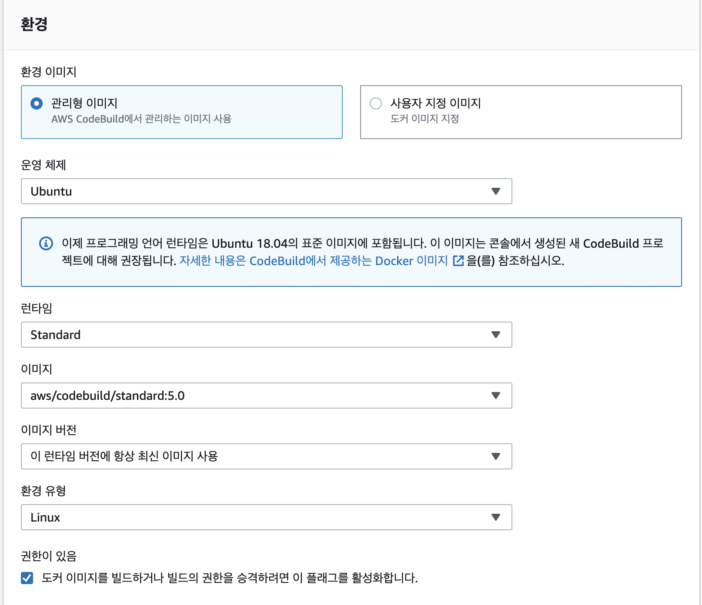

6. buildspec.yaml의 경로를 입력
    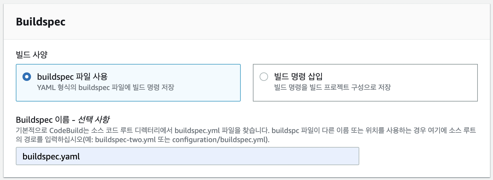

7. 서비스 역할은 [AWS CodeBuild 역할 생성](#aws-codebuild-역할-생성)에서 생성한 역할로 선택
    

## LoadBalancer 

1. 로드밸런싱 내용이 들어갈 yamls파일을 생성
    ```
    apiVersion: networking.k8s.io/v1
    kind: Ingress
    metadata:
    name: test-ingress
    annotations:
        kubernetes.io/ingress.class: nginx
        nginx.ingress.kubernetes.io/use-regex: "true"
    spec:
    rules:
        - host: 
        http:
            paths:
            - path: /
                pathType: Prefix
                backend:
                service:
                    name: testing
                    port:
                    number: 8080
    ```
2. deploy파일을 생성
    ```
    apiVersion: apps/v1
    kind: Deployment
    metadata:
    name: test-server
    spec:
    replicas: 1
    selector:
        matchLabels:
        app: test-server
    template:
        metadata:
        labels:
            app: test-server
        spec:
        imagePullSecrets:
            - name: regcred
        containers:
            - name: test-server
            image: <ecr URI>:<image tag>

    ---
    apiVersion: v1
    kind: Service
    metadata:
    name: testing
    spec:
    selector:
        app: test-server
    ports:
        - name: testing
        protocol: TCP
        port: 8080
        targetPort: 8080
    type: LoadBalancer
    ```

3. ArgoCD에서 지정한 브렌치 혹은 저장소로 push, merge
4. ArgoCD에 접속해서 새로고침 후 모두 초록불이 들어오는지 확인
5. testing이라는 이름으로 서비스가 실행됐는지 확인
    ```
    kubectl get svc
    ```
6. 서비스 타입(로드밸런서라고 적혀있어야됨), EXTERNAL-IP 확인
    ```
    NAME         TYPE           CLUSTER-IP      EXTERNAL-IP                                                                   PORT(S)          AGE
    kubernetes   ClusterIP      10.100.0.1      <none>                                                                        443/TCP          9d
    testing      LoadBalancer   10.100.250.14   (노출금지).ap-northeast-2.elb.amazonaws.com   8080:31735/TCP   3d14h
    ```
7. 아무 브라우저를 열어서 EXTERNAL-IP로 접속이 되는지 확인
    > LoadBalancer에 입력한 포트로 접속해야함\
    > 서버코드가 여는 포트도 동일해야함