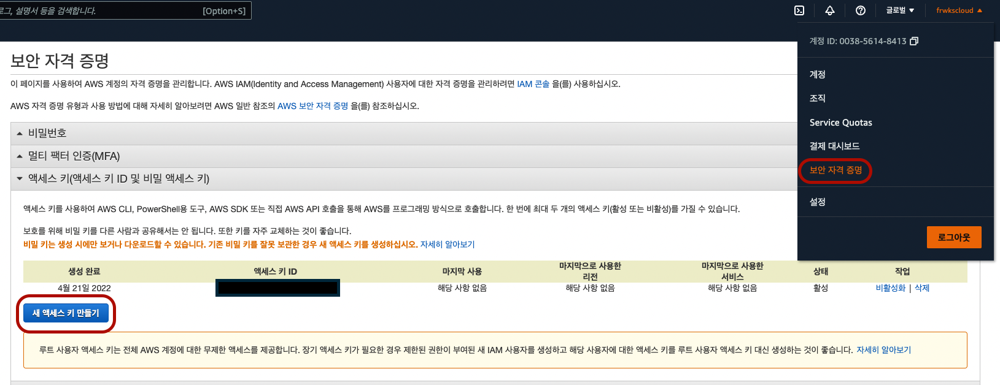
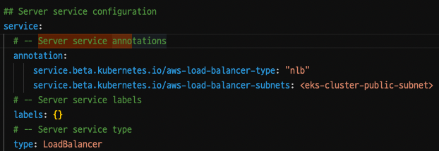
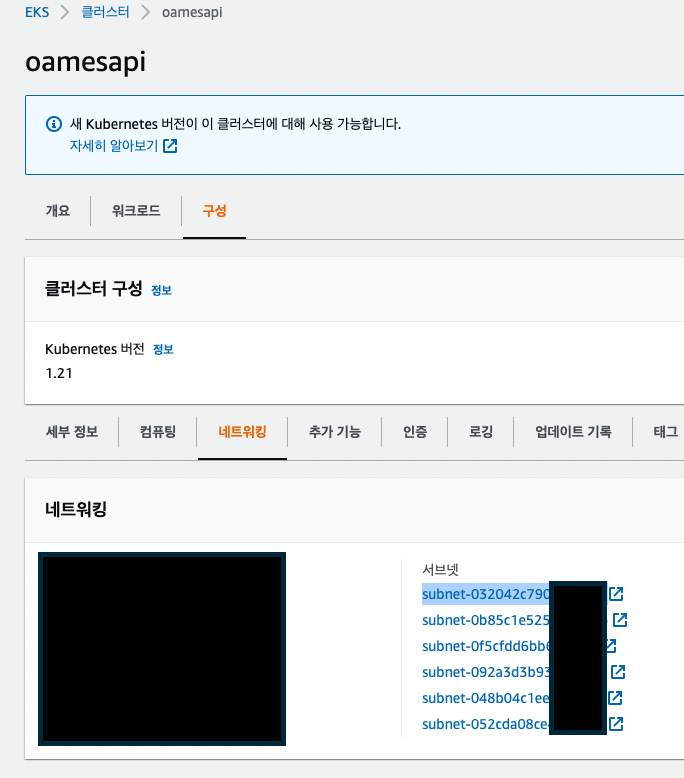
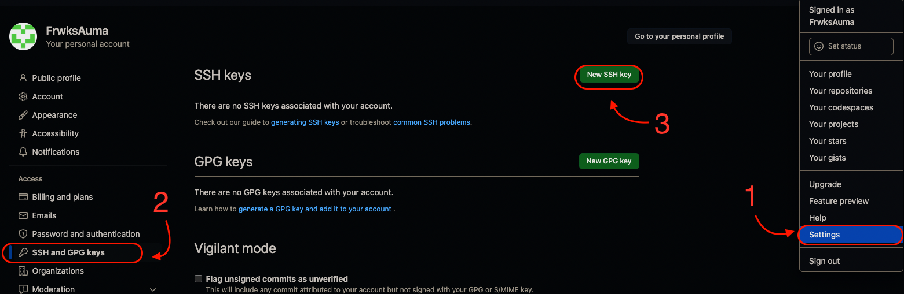
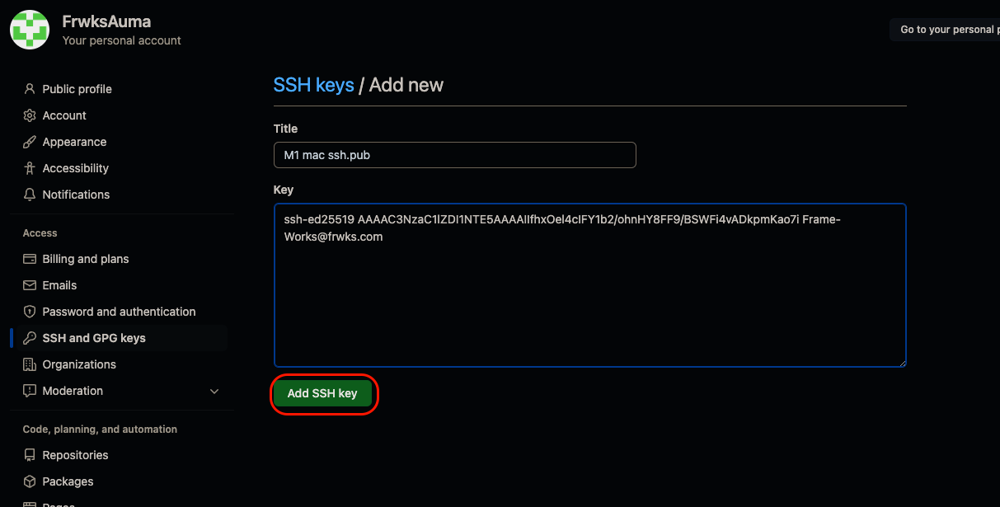

# AWS EKS 사용방법

※ [공식문서](https://docs.aws.amazon.com/eks/latest/userguide/install-kubectl.html) 보고 따라함

※ [EKS 설정 정리](https://github.com/marcincuber/eks) alb-nginx-ingress.yaml 등 설정 예시파일들이 있음

※ 모든 명령어는 mac기준으로 작성함

[argocd](https://www.bogotobogo.com/DevOps/Docker/Docker_Kubernetes_ArgoCD_with_Helm_on_Kubernetes_App_of_Apps.php)

> AWS KEY가 인터넷에 노출되면 압축된 파일이더라도 
> 바로 확인해서 계정의 할당량을 없애버리므로 주의(※ AWS가 아니더라도 KEY데이터는 절대 인터넷에 공개되지 않도록 주의)
## kubectl 설치
---

> 이미 쿠버네티스가 깔려있다면 이 과정을 스킵

> Kubernetes 1.22

AWS s3에 있는 쿠버네티스 다운로드

``` curl -o kubectl https://s3.us-west-2.amazonaws.com/amazon-eks/1.22.6/2022-03-09/bin/darwin/amd64/kubectl ```

``` curl -o kubectl.sha256 https://s3.us-west-2.amazonaws.com/amazon-eks/1.17.12/2020-11-02/bin/darwin/amd64/kubectl.sha256 ```

kubectl의 권한 변경

``` chmod +x ./kubectl ```

PATH 등록

``` mkdir -p $HOME/bin && cp ./kubectl $HOME/bin/kubectl && export PATH=$HOME/bin:$PATH ```

``` echo 'export PATH=$PATH:$HOME/bin' >> ~/.bash_profile ```

버전확인

``` kubectl version --short --client ```

## aws cli 설치
---
awscli 설치

``` brew install awscli ```

awscli 인증


``` 
aws configure --profile <생성할 프로필명> 

AWS Access Key ID [None] : [발급받은 IAM의 Access Key ID]
AWS Secret Access Key [None] : [발급받은 IAM의 Secret Access Key]
Default region name [None] : ap-northeast-2[서울 리전]
Default output format [None] : 
```
> --profile 을 사용하지 않으면 전역설정이 되며 
> 
> --profile 옵션으로 사용 시 aws, eksctl 명령어 뒤에 --profile <프로필명>으로 계정 접근

## eksctl 설치
---

macOS에 Homebrew가 아직 설치되어 있지 않은 경우 다음 명령을 사용하여 설치

``` /bin/bash -c "$(curl -fsSL https://raw.githubusercontent.com/Homebrew/install/master/install.sh)" ```

Weaveworks Homebrew 탭을 설치

``` brew tap weaveworks/tap ```

eksctl를 다음 명령으로 설치

``` brew install weaveworks/tap/eksctl ```

eksctl가 이미 설치된 경우 다음 명령을 실행하여 업그레이드

``` brew upgrade eksctl && brew link --overwrite eksctl ```

다음 명령을 사용하여 설치가 성공했는지 테스트

``` eksctl version ```

## eksctl 사용
---

fargate를 사용해서 CloudeFormation을 생성

``` eksctl create cluster --name <생성할 클러스터 명> --region <리전코드> --fargate [--profile <프로필명>]```
> CloudFormation은 무료이며 region-code는 [여기를 참고](https://docs.aws.amazon.com/ko_kr/AWSEC2/latest/UserGuide/using-regions-availability-zones.html)

## [argoCD 설치](https://argo-cd.readthedocs.io/en/release-1.8/getting_started/)
---
> Docker Desktop에서 AWS EKS에 접속되어있는지 확인하고 시작할 것

Argo CD CLI 설치

``` 
brew install argocd
```
> 로컬에서 Argo CD 명령어를 사용할 수 있어야 하므로 CLI를 깔아준다.

argocd 네임스페이스 생성 및 등록

``` 
kubectl create namespace argocd
kubectl apply -n argocd -f https://raw.githubusercontent.com/argoproj/argo-cd/stable/manifests/install.yaml
```

Argo CD 포트포워딩

``` kubectl port-forward svc/argocd-server -n argocd 8080:443 ```
> 포트포워딩 후 다른 터미널을 추가로 열어준다.

Argo CD 패스워드 확인

``` kubectl -n argocd get secret argocd-initial-admin-secret -o jsonpath="{.data.password}" | base64 -d ```

Argo CD CLI 로그인

``` argocd login http://localhost:8080 ```
> Username은 admin
>
> Password는 위에 패스워드 확인한 내용
>
> ※ 패스워드 마지막에 ```%```가 있으면 빼고 입력

등록된 클러스터 확인

``` kubectl config get-contexts -o name ```

Argo CD에 클러스터 추가

``` argocd cluster add <사용할 클러스터명> ```

### helm으로 Argo CD 설치
``` 
helm repo add argo https://argoproj.github.io/argo-helm

helm repo list

helm repo update

helm fetch argo/argo-cd

tar -xvzf <argo-cd압축파일명>
```

압축 해제 후 argo-cd 폴더 내부 values.yaml 파일 편집


```
annotation:
  service.beta.kubernetes.io/aws-load-balancer-type: "nlb"
  service.beta.kubernetes.io/aws-load-balancer-subnets: subnet-032042c7xxxxxxx, subnet-0b85c1e5xxxxxxxxx, subnet-0f5cfdd6xxxxxxxxx, 

type: ClusterIP -> LoadBalancer로 변경
```
> 서브넷에 있는 코드 2 ~ 3개 정도를 service.beta.kubernetes.io/aws-load-balancer-subnets에 작성


values.yaml파일을 helm으로 ArogCD 설치 

``` helm install argo -n argo argo/argo-cd -f values.yaml ```

argo-agrocd-server의 EXTERNAL-IP의 주소로 들어가서 AgroCD UI확인 가능

``` kubectl get po,svc -n argo ```
> 안되면 10분만 기다렸다가 해보기

Argo CD 패스워드 확인

``` kubectl -n argocd get secret argocd-initial-admin-secret -o jsonpath="{.data.password}" | base64 -d ```
> ID는 admin으로 고정


--------------------------

``` aws sts get-caller-identity ``` 의 ARN이 클러스터 생성자와 일치하는지 확인

``` aws eks update-kubeconfig --name <클러스터명> --region <리전> ``` 

``` ARGOCD_SERVER=`kubectl get pods -n argocd -l app.kubernetes.io/name=argocd-server -o name | cut -d'/' -f 2` ```
``` ARGOCD_SERVER_HOST=`kubectl get svc argocd-server -o json -n argocd | jq -r '.status.loadBalancer.ingress[0].hostname'` ```
> 여기서 jq가 없으면 ``` brew install jq ```


--------------------------

## argocd 저장소 등록
---
ssh key 생성
   
```ssh-keygen -t ed25519 -C "<이메일>" ```
``` 
---
Enter file in which to save the key (/Users/account/.ssh/id_ed25519): /Users/account/.ssh/<저장할 ssh-key명>

Enter passphrase (empty for no passphrase): 엔터

Enter same passphrase again: 엔터
```
> ArgoCD에서 ssh키를 사용할 땐 RSA형식이면 안됨
>
> 비밀번호를 입력하면 복잡해지므로(경험X) 엔터를 눌러 비밀번호를 스킵

공개키 복사

``` pbcopy < ~/.ssh/<ssh-key명>.pub ```

github에 ssh key 등록



argocd cli로 git repo 등록

``` argocd repo add git@github.com:<Git아이디>/<레포지토리>.git --ssh-private-key-path ~/.ssh/<ssh-key명> --upsert ```

## ingress-nginx 설치
---
네트워크 로드밸런서 활성화

``` kubectl apply -f https://raw.githubusercontent.com/kubernetes/ingress-nginx/controller-v1.1.3/deploy/static/provider/aws/deploy.yaml ```

-- [참고사이트](https://twodeveloper.tistory.com/76)

argocd에 적용

[](assets/ingress_in_argocd.png)

## AWS ECR 
---
> AWS ECR 생성 후 리포지토리에 들어가서 푸시명령 보기에 적힌대로 buildspec.yaml에 작성


## eks 대시보드
---

대시보드 설치

``` kubectl apply -f https://raw.githubusercontent.com/kubernetes/dashboard/v2.0.5/aio/deploy/recommended.yaml ```

대시보드 바인딩 파일 생성

```
# 파일명 eks-admin-service-account.yaml

apiVersion: v1
kind: ServiceAccount
metadata:
  name: eks-admin
  namespace: kube-system
---
apiVersion: rbac.authorization.k8s.io/v1
kind: ClusterRoleBinding
metadata:
  name: eks-admin
roleRef:
  apiGroup: rbac.authorization.k8s.io
  kind: ClusterRole
  name: cluster-admin
subjects:
- kind: ServiceAccount
  name: eks-admin
  namespace: kube-system

```

대시보드 바인딩 파일 적용

``` kubectl apply -f eks-admin-service-account.yaml ```

대시보드 접속 토큰확인

``` kubectl -n kube-system describe secret $(kubectl -n kube-system get secret | grep eks-admin | awk '{print $1}') ```

대시보드 프록시 시작

``` kubectl proxy ```

대시보드 접속 주소

``` http://localhost:8001/api/v1/namespaces/kubernetes-dashboard/services/https:kubernetes-dashboard:/proxy/#!/login ```


## Load Balancer Controller
---
> ※ 내용이 자세히 기억이 안나므로 검색해서 하는 것을 추천
>
> [공식문서](https://docs.aws.amazon.com/ko_kr/eks/latest/userguide/aws-load-balancer-controller.html)

<!-- ```
eksctl utils associate-iam-oidc-provider \
    --region us-west-2 \
    --cluster oames-api \
    --approve
``` -->

AWS API를 호출할 수 있는 AWS 로드 밸런서 컨트롤러의 IAM 정책 다운로드
```
curl -o iam-policy.json https://raw.githubusercontent.com/kubernetes-sigs/aws-load-balancer-controller/main/docs/install/iam_policy.json
```

다운로드한 정책을 사용하여 IAM 정책 생성
```
aws iam create-policy \
    --policy-name AWSLoadBalancerControllerIAMPolicy \
    --policy-document file://iam-policy.json
```

IAM 역할을 생성하고 AWS 로드 밸런서 컨트롤러의 kube-system 네임스페이스에 aws-load-balancer-controller라는 Kubernetes 서비스 계정을 추가
```
eksctl create iamserviceaccount \
--cluster=<클러스터명> \
--namespace=kube-system \
--name=aws-load-balancer-controller \
--attach-policy-arn=arn:aws:iam::<aws-account>:policy/AWSLoadBalancerControllerIAMPolicy \
--approve
```

```
kubectl apply -k "github.com/aws/eks-charts/stable/aws-load-balancer-controller//crds?ref=master"
```

```
helm upgrade -i aws-load-balancer-controller eks/aws-load-balancer-controller -n kube-system --set clusterName=<클러스터명> --set serviceAccount.create=false --set serviceAccount.name=aws-load-balancer-controller
```


## ※ 주의사항

- 서버의 포트와 ingress로 지정한 포트는 동일해야함.
> 포트가 다를 시 증상 : aws 로드밸런스에서 인스턴스가 실행되지 않는다며 EXTERNAL-IP로 접근 시 ERR_EMPTY_RESPONSE 에러가 남

- String boot서버를 도커로 열 때에는 build.gradle에 
``` 
jar {
	enabled = false
}
```
를 추가한다


## 태그
---
#alb-nginx-ingress #eks #route53 #codebuild #ecr #cert-manager #argocd #helm #loadBalancer
