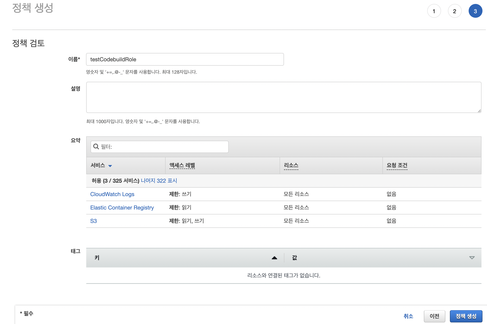
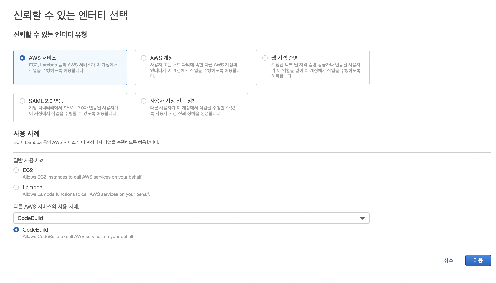
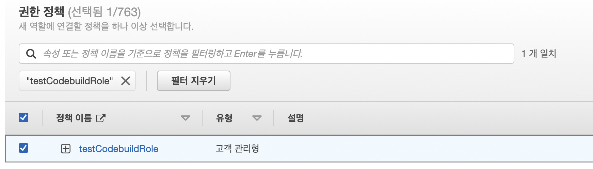
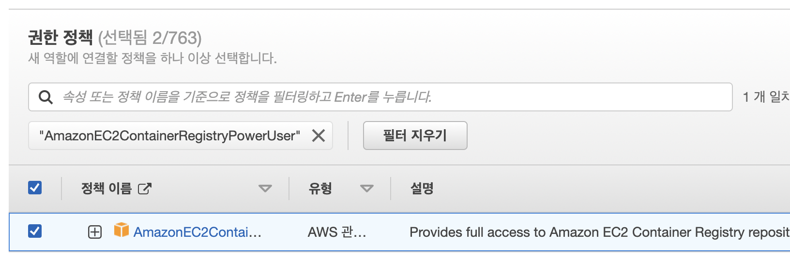

# CodeBuild role

1. AWS IAM의 정책메뉴 클릭
2. 정책생성 > JSON에 다음 내용을 붙여넣기
    ```
    {
        "Version": "2012-10-17",
        "Statement": [
            {
            "Sid": "CloudWatchLogsPolicy",
            "Effect": "Allow",
            "Action": [
                "logs:CreateLogGroup",
                "logs:CreateLogStream",
                "logs:PutLogEvents"
            ],
            "Resource": [
                "*"
            ]
            },
            {
            "Sid": "S3GetObjectPolicy",
            "Effect": "Allow",
            "Action": [
                "s3:GetObject",
                "s3:GetObjectVersion"
            ],
            "Resource": [
                "*"
            ]
            },
            {
            "Sid": "S3PutObjectPolicy",
            "Effect": "Allow",
            "Action": [
                "s3:PutObject"
            ],
            "Resource": [
                "*"
            ]
            },
            {
            "Sid": "ECRPullPolicy",
            "Effect": "Allow",
            "Action": [
                "ecr:BatchCheckLayerAvailability",
                "ecr:GetDownloadUrlForLayer",
                "ecr:BatchGetImage"
            ],
            "Resource": [
                "*"
            ]
            },
            {
            "Sid": "ECRAuthPolicy",
            "Effect": "Allow",
            "Action": [
                "ecr:GetAuthorizationToken"
            ],
            "Resource": [
                "*"
            ]
            },
            {
            "Sid": "S3BucketIdentity",
            "Effect": "Allow",
            "Action": [
                "s3:GetBucketAcl",
                "s3:GetBucketLocation"
            ],
            "Resource": 
                "*"
            }
        ]
    }
    ```
    
3. IAM 역할로 이동 후 역할생성
4. 사용 사례 > 다른 AWS 서비스...에서 CodeBuild 선택\
    

5. 정책 2가지 추가
    ```
    testCodebuildRole

    AmazonEC2ContainerRegistryPowerUser
    ```
    
    
    