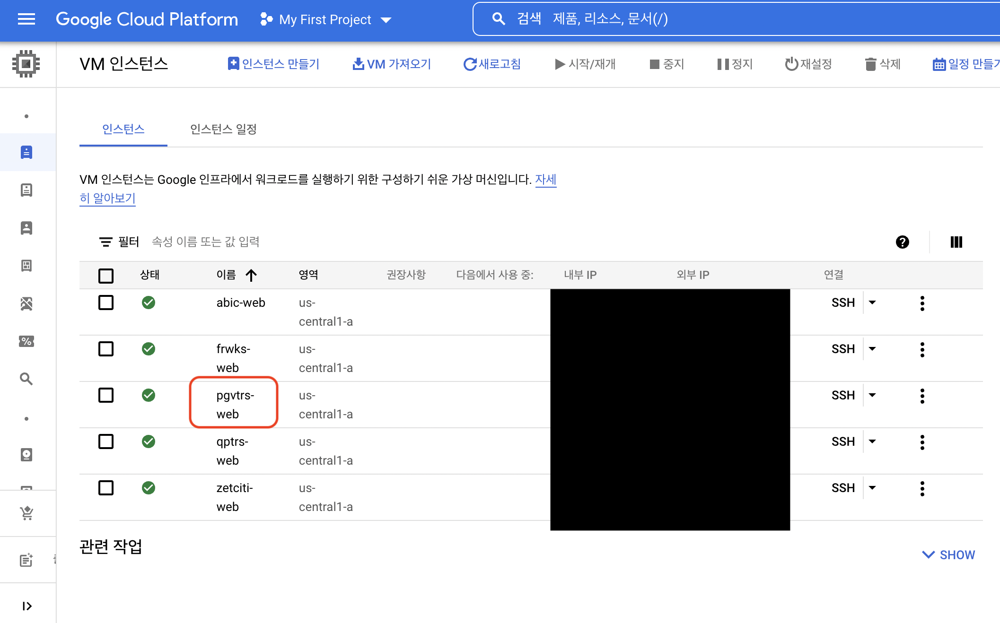
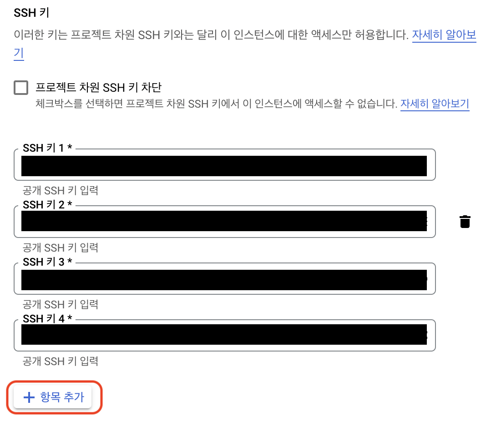
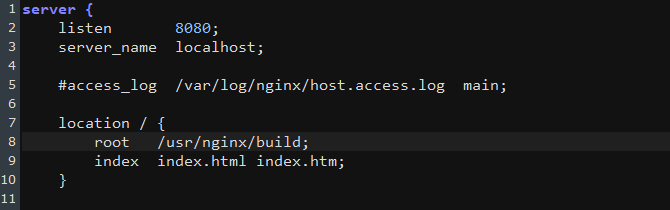
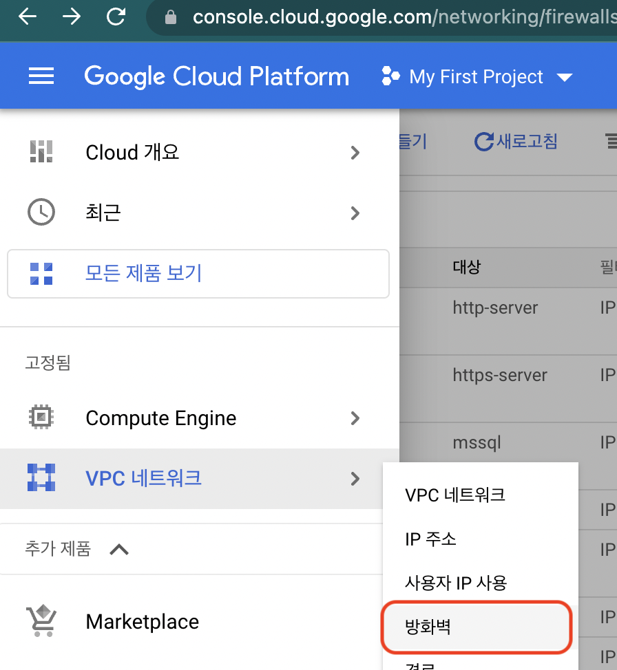
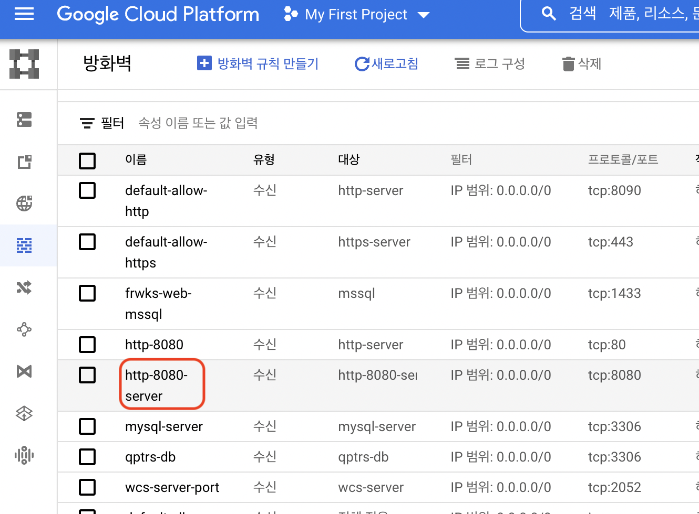

# GCP가상머신 서버

## 세팅 내역
- [GCP가상머신 서버](#gcp가상머신-서버)
  - [세팅 내역](#세팅-내역)
  - [SSH 생성](#ssh-생성)
  - [GCP SSH 접속](#gcp-ssh-접속)
  - [nginx 설치](#nginx-설치)
  - [GCP 방화벽 설정](#gcp-방화벽-설정)
  - [react 빌드파일](#react-빌드파일)
  - [Java설치](#java설치)
  - [spring boot 빌드파일](#spring-boot-빌드파일)
  - [mysql 설치](#mysql-설치)

## SSH 생성
[참고문서](https://github.com/AuMaHub/how-to-use-git/tree/master/git%20ssh%20%EC%83%9D%EC%84%B1)

## GCP SSH 접속
1. GCP 접속
2. VM 선택
    
3. SSH 퍼블릭키 등록
    

## nginx 설치
1. nginx.repo 열기(빈파일임)
    ```
    vi /etc/yum.repos.d/nginx.repo
    ```
2. 아래내용을 입력
    ```
    [nginx]
    name=nginx repo
    baseurl=http://nginx.org/packages/centos/7/$basearch/
    gpgcheck=0
    enabled=1
    ```
    > baseurl에 centos버전 맞는지 꼭 확인
3. nginx 설치
    ```
    yum install -y nginx
    ```
4. nginx 버전확인
    ```
    nginx -v
    ```
5. 포트 변경 및 실행파일 위치 변경
    ```
    sudo vi /etc/nginx/conf.d/default.conf
    ```
    
    > location.root의 경로가 실행 위치폴더임
6. nginx 리로드
    ```
    nginx -s reload
    ```

## GCP 방화벽 설정
1. VPC에 방화벽 접근
    
2. 열고 싶은 포트 생성
    
3. GCP VM으로 가서 수정 -> 방화벽 이름 추가
    

## react 빌드파일
1. 개발 컴퓨터에서 react빌드 폴더를 생성
2. filezilla같은 FTP로 nginx실행파일 위치에 build폴더 이동
3. ```GCP VM의 외부IP:포트``` 로 접근이 가능한지 확인

## Java설치 
1. java 11 install
    ```
    yum install java-11-openjdk-devel.x86_64
    ```
2. 버전확인
    ```
    java -version
    ```

##  spring boot 빌드파일
1. 개발 컴퓨터에서 빌드해서 jar파일 생성
2. filezilla같은 FTP로 jar파일 이동(위치는 상관없음)
3. jar파일 실행
    ```
    nohup java -jar <경로>/<파일명>.jar > log.out
    ```
    > 백그라운드실행에 log.out으로 로그를 남김

## mysql 설치

1. mysql 8.0 설치
    ```
    sudo yum install -y https://dev.mysql.com/get/mysql80-community-release-el7-3.noarch.rpm
    ```
2. gpg 키 설정
    ```
    rpm --import https://repo.mysql.com/RPM-GPG-KEY-mysql-2022
    ```
3. mysql 서버 설치
    ```
    sudo yum install -y mysql-server
    ```
4. mysql 설정
    ```
    systemctl enable mysqld && systemctl start mysqld && systemctl status mysqld
    ```
5. 패스워드 확인
    ```
    sudo grep 'temporary password' /var/log/mysqld.log
    ```
6. mysql 접속
    ```
    mysql -u root -p

    Enter password: <패스워드 확인에서 본 비밀번호 입력>
    ```
7. mysql root 비밀번호 변경
    ```
    ALTER USER 'root'@'localhost' IDENTIFIED BY '<보안규칙에 맞는 비밀번호>';
    ```
    > 대문자, 소문자, 특수문자, 8자리 이상 인듯함.

8. 외부 접근 계정 생성 및 권한부여
    ```
    create user '<계정명>'@'%' identified by '<비밀번호>';
    grant all privileges on *.* to '<계정명>'@'%' WITH GRANT OPTION;
    flush privileges;
    show grants for '<계정명>'@'%';
    ```
