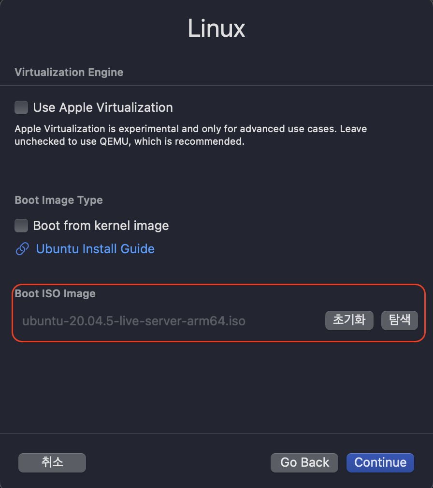

# VM

## [UTM](https://mac.getutm.app/)

> 작업 사양
> OS : macOS Ventura 13.6
> chip: Apple M1
> memory: 16GB

### 우분투 설치

> AMD64로 설치할 경우 CPU는 qemu64에 4코어 이상 (필자는 8코어로 진행함) Forced MultiCore 활성화를 꼭 설정해야됨

1. <https://cdimage.ubuntu.com/releases/20.04/release/>에서 `64-bit ARM (ARMv8/AArch64) server install image`다운로드
2. [UTM](https://mac.getutm.app/)에서 `UTM` 다운로드 및 설치
3. `UTM`실행 후 새 가상머신 만들기
4. `Virtualize`선택 후 `Linux`선택

5. 1번에서 받은 ISO의 경로만 넣고 다음
6. 메모리는 4GB이상 하드웨어 가속은 웬만하면 키기
7. 디스크 사이즈는 편한대로 (필자는 64GB로 진행)
8. 공유폴더는 X
9. 이름 설정하고 저장
10. 언어, 키보드, 계정 설정하고 SSH는 설정 X
